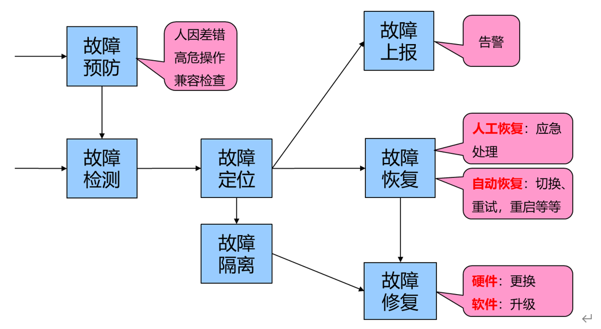

# 03 可靠性概念术语

## 1 前言

世界上没有永恒可靠的事物。身体再强壮的人也是会生病的，再好的硬件设备也是会坏掉的，再好的软件也有不工作/卡死的时候。产品的失效（不正常工作）会造成巨大的损失，包括经济利益上的损失和名声声誉上的损失，甚至引发社会问题。

现在大家都离不开手机，如果网络产生半个小时的中断，你都会不可接受。几年前曾经发生过某著名通信公司的设备故障导致某通信运营商的通话中断，该运营商的高端客户将该运营商的营业厅砸坏了，不但造成该运营商的经济损失，也引发了人身不安全因素，同时也造成了该运营商的声誉受损。这只是民用领域，如果是在航天，军工，那不但会造成人员伤亡（例如1986年美国挑战者号爆炸，7宇航员遇难），还可能会导致战争失败，国家灭亡。因此可靠性的重要性不言而喻。

可靠性的发展起源于20世纪40年代。主要历程如下：

1）20世纪40年代：萌芽，1943年美国成立了电子管研究委员会专门研究电子管的可靠性问题

2）20世纪50年代：奠基，1957年发表了《军用电子设备可靠性》的研究报告，标志着可靠性成为一门独立的科学。

3）20世纪60~70年代：发展、成熟，美国在军工强制推行可靠性工程，新成较完善的可靠性标准；日本在1956年从美国引入可靠性技术，2年后成立了可靠性研究会，并在1971年召开第一届可靠性技术研讨会；英国1962年出版《可靠性与微电子学》；法国在1962年成立可靠性中心；1964年，前苏联召开可靠性学术会议；1965年国际电子技术委员会设立可靠性技术委员会

4）20世纪80年代以来：系统化，将可靠性，维修性和保障性有机的结合在一起，形成可靠性系统工程。我国也是在这个时候在武器装备中开展可靠性工程，在21世纪初，可靠性工程进入民用企业，全面的深入研究与应用。

有人会把可靠性等同于质量，而且更有甚者，认为可靠性是质量部门的事情，产品设计部门很少参与，其实广义上来讲，可靠性仅是质量属性之一。同时可靠性源于设计，一个产品的可靠性好不好在设计阶段就决定了的。因此钱学森曾说：可靠性是设计出来的，是管理出来的。

## 2  什么是可靠性

### 2.1 定义

可靠性是指产品在规定的条件下和规定的时间内完成规定的功能的能力，即通常所说的“三规”。通俗一点的理解，狭义的可靠性指的是产品在使用期间没有发生失效的特质（Reliability）；广义可靠性是指使用者对产品的满意程度和依赖程度（Dependability），而这种满意和信赖程度是主观上的，定量判断的话就是规定条件和规定时间内的稳定的完成系统功能的程度。

1）规定的条件：产品使用的环境条件，工作条件等。例如存储产品在不同的环境温度、环境湿度、噪音震动下，其可靠性表现就不一样；汽车在高速路上行驶和在山路上形式，其可靠性表现也不一样。产品的可靠性是在一定的条件下的。

2）规定的时间：产品规定了的任务时间/次数，随着产品任务时间/次数的增加，产品出现故障的概率将增加，整体的可靠性会降低。一个用了5年的产品和刚生产出来的产品，后者的故障概率明显会小了很多。

3）规定的功能：是指产品必须要具备的功能及时对应的技术指标。产品功能的多少和技术指标的高低都会影响可靠性指标的高低。比如要求空调要能制冷、制热、送风、定时等功能，相应的技术指标比如5分钟完成制冷。

### 2.2 目标

客户对可靠性的期望是怎样的呢，分为以下三个层面：

理想的：不要出故障。只可减少，不可能做到，因为硬件总是会坏的，软件谁也无法保证能够永远运行

现实的：出了故障之后，能够自动恢复，不影响业务（不产生失效），在大多数情况下是可以实现的。

保底的：出了故障无法自动恢复，影响业务后能够通过人工快速恢复（追求恢复的速度），这是产品必须要提供的。

可靠性工程聚焦在现实层面和保底层面，提供自动或者人工的故障恢复机制。理想层面主要通过软件工程（软件故障）和硬件工程（硬件故障）来降低故障的产生概率。

## 3 如何做到高可靠

可靠性是与故障作斗争的，对故障处理的程度代表着系统可靠性的高低，那么对故障的容错（包含错误、缺陷，这里统称为故障）机制有哪些呢？可以归结为8个字：故障管理，冗余设计

### 3.1 故障管理

故障管理的机制包含故障预防，故障检测/定位，故障上报，故障隔离，故障恢复/修复，如下图所示：

说明：

故障恢复：通过冗余的手段将业务恢复，故障本身可能并没有彻底解决

故障修复：指的是故障对象的彻底恢复，硬件换新，软件升级

#### 3.1.1 故障预防

故障预防就是我们经常说的病从口入，在系统的边界处设置一道防线，将会导致系统产生失效的行为拒之门外。常用的机制如下：

##### 3.1.1.1 防人因差错

人非圣贤，孰能无过，谁都不能保证对产品的操作100%正确，比如说不小心把抓包信息放入到根目录了；不小心把硬盘位置插错了，不小心把IP地址配重复了等等。防人因差错主要在三个方面：

1） 防用户出错：例如硬件上通用的USB接口防插反，软件上阻止用户非法输入进入系统，配置IP时对系统内已存在的IP地址进行校验阻止重复的IP地址进入系统等等

2） 防出错影响：在无法防止用户出错的情况下，要能够阻止用户出错对系统的影响，比如用户就不小心把两个主机上的硬盘互换插入了，用户不小心加入了一台配置了重复IP地址的主机等。这就要有机制保证插反的硬盘不会影响当前系统的业务连续性和数据完整性，新入的重复IP地址的主机也不会影响当前系统的业务连续性和数据完整性。

3） 改错误结果：用户输入了系统不认为错误的但是在用户看来是错误的信息后，要能支持用户进行在线修改。比如用户配置存储的时候本来是要选择3副本的，但是一不小心选成了2副本，要能够支持用户不删除存储的情况下修改副本数。

##### 3.1.1.2 高危操作

系统运行过程中，用户会对系统进行运维（更改/新系统配置，查询系统信息，更换硬件，扩容系统，升级系统等等），原则上要求这些动作不能对用户的业务产品影响（失效），如果无法做到（比如修改配置），那么就需要对用户进行风险说明，由用户对风险进行确认后再操作。

除了系统的操作外，用户对业务对象的操作也可能存在风险，比如删除类（删除虚拟机，格式化硬盘等等）的操作；涉及到海量数据查询的操作也可能会影响其他的业务操作。

高危操作主要包含删除类，更改类，查询类（海量查询）这三类针对系统本身以及用户业务的操作。

##### 3.1.1.3 防失败检查

有些故障对当前的业务没有影响但是会导致后续业务失败，对于这些故障也要在后续业务的入口处进行检查，体现为两个方面：

1） 兼容性检查：对于不兼容的软件、硬件、运行环境要在软件、硬件进入系统的时候进行检查，禁止它们进入系统。比如我们的产品不兼容某个操作系统或者某种硬件，那么在产品安装的时候就应该阻止安装。

2） 失败检查： 类似于升级这样的运维操作，其操作是多个步骤组成的一个过程，而且其操作也会持续一定的时间。需要提前检查会导致升级失败的因素，如果这些因素存在，则不允许进行升级，降低升级失败的概率。

#### 3.1.2 故障检测

一个故障要想得到容错处理，它首先要要能够被发现，也就是要能够被检测到，通常通过两种途径（业务路径、非业务路径）进行故障的检测：

1） 业务路径：业务处理过程中的会导致业务出现失败的故障，例如对端超时无响应，数据读写失败，数据读写错误，消息发送失败等。这种检测具有实时性，因此对故障的容错处理也是实时的才能保证不发生业务失效。比如当前读取数据失败后，立刻从数据的另一个副本读取数据；对端超时后进行重试或者切换到对端的冗余节点进行业务。

2） 非业务路径：也可以称作为第三方，这种故障业务流程是不能直接感知到的，但是会潜在的或者直接的导致业务失败的故障。例如进程挂死，网络断开，资源过载、电源损坏，SSD寿命到期等等，这类故障也包含业务路径可以检测到的但是业务当前还没有运行到的，比如硬盘坏道，当业务还没有运行到坏道处的时候不会对业务有影响，但是需要通过第三方的检测方式提前发现并进行容错处理，以避免潜在的数据丢失风险。

#### 3.1.3 故障定位

故障定位和故障检测本质是一体的，在进行检测的时候就同时给出故障发生的位置。比如网络中断，给出导致断开的具体部位，是网口坏了还是光纤坏了还是交换机坏了，这样才能准确地进行故障的容错（自动的、人工的）。对于软件要求定位到可管理单元（FMU），就是软件模块（进程，服务，文件等等）；对于硬件要能定位到可更换单元（FRU），例如硬盘（哪个服务器哪个槽位），网口（哪个网卡的第几个网口），光模块（哪个网口），内存（哪个插槽）。

#### 3.1.4 故障上报

故障上报是一个让用户感知故障的过程，需要用户介入处理的故障才需要上报。有如下几种类型：

1） 故障预警类：当前还未产生业务影响，但是如果不处理，后续可能产生影响。比如资源过载，容量过载，硬件/授权寿命到期之类的故障

2） 自动容错类：对该故障系统有自动容错措施，未对用户产生业务影响，但是系统无法自动恢复该故障，需要人工介入恢复，比如进程无法启动，网络连接断开，硬件损坏等

3） 业务失效类：该故障已经对用户业务造成了影响，系统无法自动恢复该故障，比如数据损坏 ，主备倒换失败，主备机同时故障、控制台无法登陆等等

#### 3.1.5 故障隔离

将发生故障的软件模块，硬件部件，网络连接从系统中隔离出去，以避免对业务的影响，这是容错机制的一种。该机制能够起到这用的前提是软件模块，硬件部件，网络连接在系统内有冗余备份，当该故障对象被隔离后，由其冗余备份的对象接替进行工作。故障的隔离有两种情况：

1）暂时性：主要针对可以修复的故障（绝大多数的故障都是此类），故障修复后故障对象继续提供服务，包含软件程序的重新启动，数据文件的重新恢复，硬件部件的更换等等。

2）永久性：针对无法修复的故障，被隔离的对象后续不再提供服务，比如磁盘的坏道，如果在写数据的时候出现坏道，就会将该坏道区域从磁盘中隔离出去，而将数据写向系统保留的区域，这个保留区域其实就是原坏道区域的一种冗余备份。

需要进行故障隔离的典型故障是亚健康类的，如果真正故障了完全不工作了，不用隔离也不会对系统有影响，亚健康类的故障并不是完全不能工作，而是不能健康的工作，例如硬件运行速度变慢（慢盘），硬件局部损坏（硬盘局部坏道）；软件模块出现频繁启动停止、运行缓慢、资源泄露/过载等；网络连接出现高延迟，丢包、错包、闪断、抖动等现象。

#### 3.1.6 故障恢复

故障恢复是指故障发生后将系统恢复到故障前的状态，包含两个层面的恢复，第一个层面是业务层面，业务处理能力恢复到故障前；第二个层面是故障对象自身层面，故障对象恢复到故障前的状态（我们称作故障修复）。有些情况下，业务层面的恢复依赖于故障对象自身的恢复，有些则不依赖于故障对象的恢复。

##### 3.1.6.1 业务恢复

业务层面的恢复一般是通过冗余机制来实现的，包含时间的冗余(重试)和空间的冗余（双机、集群、多副本、数据备份等），分为两种方式，一种是自动的（上面的客户期望的现实层次），这种方式是要保证在故障发生的时候仍然能实现的业务的连续性，不会导致业务中断。另一种是人工的方式，这种方式一般是发生的故障（比如主机无法启动，主备倒换失败，系统整体断电，系统配置数据丢失等）导致了业务中断，人工介入进行恢复（通常称为应急处理）。

##### 3.1.6.2 故障修复

对于硬件对象的故障修复一般都是通过更换来实现的(部分也可以通过硬件自身的修复来实现)，对于软件程序类的对象的故障修复一般是通过升级补丁来实现的，软件数据类的对象的故障修复一般是通过数据的备份（数据多副本也是一种备份）恢复机制来实现的。

对于故障对象的修复过程也要做到不影响业务，因为故障的发生过程中都没造成业务影响，那么故障本身的修复过程，更不能影响业务。

### 3.2 冗余设计

冗余设计又称余度设计技术，是指在系统或设备完成任务起关键作用的软件模块或者硬件部件，增加一个或者多个完成相同功能的软件模块或者硬件部件，以保证当该部分出现故障时，系统或设备仍能正常提供业务，减少系统或者设备的业务中断概率，提高系统整体可靠性。我们现在使用的主备双机和负荷分担集群就是典型的冗余设计。常见的冗余方式如下：

1）1+1（主备）：只有主在工作，备的不工作，典型的如网络的主备绑定模式（mode 1），主备双机

2）1+1（互备）：两个都在工作，当一个故障后，另一个承担所有业务。典型的网络的负荷分担绑定模式（mode 0 2 3 4 5 6），集群式双机

3）N+N：2N或者N个在工作，最多可以坏掉N个。典型的如大型服务器的电源，风扇。

4）N+M：N+M或者N个在工作，但是最多可以坏掉M个。典型的如大型服务器的电源，风扇，分布式集群（比如Zookeeper）

其实冗余设计本质上是解决硬件故障的导致的业务失效问题，因为不同的硬件个体是不一样的，但是对于软件则不然，只要是使用同一套代码写的，都是完全一样的，在一个节点上产生了软件故障，切换到另一个节点上也会产生同样的故障，因为这两个节点上的软件程序是一样的（除非两个节点上的软件程序采用不同的实现方式，航空航天领域冗余节点的程序会采用不同的实现方式，比如主节点程序采用C实现，备用节点程序采用汇编语言实现）。

