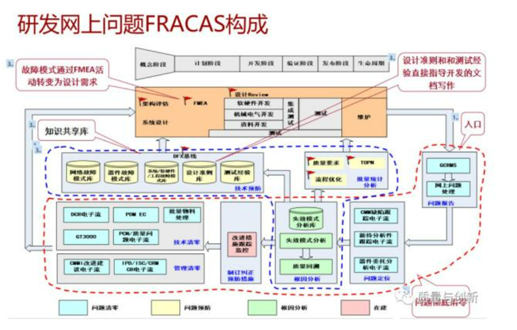
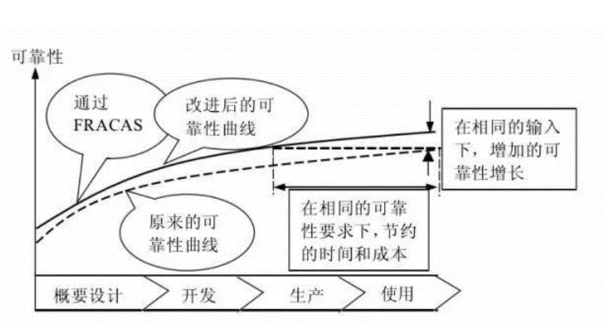

# 04 FRACAS

## 1 概念定义
FRACAS：失效报告、分析和纠正措施系统，Failure Report Analysis and Corrective Action System，缩写为FRACAS，是通过报告产品的故障，分析故障原因，制定和实施有效的纠正措施，以防止故障的再现，同时把故障根本原因和纠正措施信息反馈到设计过程中，改善和促进产品的可靠性增长。

## 2 业界发展
1980年颁布的美军标MIL-STD-785B 《系统和设备研制生产的可靠性大纲》要求军用系统承包商建立FRACAS，以有效地开展、监督和控制研制过程中的故障报告、分析和纠正活动。为使这一工作更加规范化，1985年美国国防部又颁发了军用标准MIL—STD．2155(AS)《失效报告、分析和纠正措施系统》，对故障报告、分析和纠正活动规定了统一的要求和准则。

我国早在1986年由原国防科工委颁布的《军工产品质量管理条例》中，就提出了承制单位应当制定质量、可靠性信息的收集、传递、处理、贮存和使用的管理办法，并同使用单位建立质量信息反馈网络、故障报告制度和采取纠正措施制度。之后，为满足在我国军工领域推行可靠性工程的需要，参照美军标先后于1988年颁布了国军标GJB450《装备研制和生产的可靠性通用大纲》，1990年颁布了GJB841《故障报告、分析和纠正措施系统》，明确要求承制单位在军工产品的研制和生产阶段建立FRACAS，并规定了该系统建立及运行的程序、方法和要求。后来又发布了GJB450A

目前FRACAS已经随着可靠性进入民用领域而在各个企业广泛实施，是业界通行的问题管理系统，几乎所有的成熟公司都有类似的系统。FRACAS是质量回溯工作的扩展，通过闭环实现持续改进！华为公司在10多年前就建立了FRACAS系统，如下图所示：

对每个问题进行失效模式分析后，形成失效模式库、设计准则库和测试经验库等知识库，这些就是实打实的知识金矿，在设计前端用好这些知识,就可以规避同类问题，将问题快速收敛和归零

## 3 价值作用
1） 是实现产品可靠性增长和提高产品质量的重要手段，因为它既纠正当前故障的现实意义，又能对未来新产品新特性发生类似的故障起到预防的作用

2） 积累大量故障处理的实践经验（设计准则），对类似产品的可靠性改进与设计（例如FMEA）提供参考输入，起到“举一反三”作用

3） 建立企业问题/故障信息数据库，为产品可靠性分析设计以及维修策略、保障策略、备件策略的制定提供数据支撑

4） 是开展可靠性工程活动的重要组成部分，能够起到降低产品整体成本的作用，如下图所示：相同可靠性要求下，节约时间和成本；相同的投入成本下，可靠性提升幅度更大

## 4 实施建议
FRACAS是一个工作系统，也是一个故障信息平台，该系统的输入是网上问题（已经处理完了的），其输出包含两大类：一类是技术输出，包括故障模式库，设计准则库，测试经验库，另一类是管理输出，包括故障统计数据，流程改进等。

### 4.1 输入

FRACAS系统的输入是在icare中已经关闭的网上问题，并且是产品的质量问题的。对于每个网上问题需要提供的关键信息包括：

1） 客户业务失效表现：例如客户业务卡慢

2） 导致业务失效的技术原因：出现慢盘，但是不具备慢盘隔离能力

3） 业务失效的触发条件：例如做了升级、配置变更或者CPU资源占用达到XXX

4） 失效持续时间：业务中断2小时

5） 发生故障的模块：XXX进程，硬盘等等

### 4.2 分析

对问题的属性进行ODC分析（此处不详细介绍了，和TD里面类似的）以及对每个问题进行失效模式分析（包括故障模式，设计准则，测试经验）。

1） 提取故障模式：基于问题出现的技术根因，如果是因为某种故障表现所导致的话，就把故障表现提取出来，即为故障模式。例如某技术根因描述为XXX进程内存泄漏导致主机内存耗尽而发生宕机。那么就提取内存泄漏这个故障模式

2） 总结设计准则：基于问题出现的技术根因，如果是因为某种逻辑实现不合理导致的问题的话，就把如何避免这样的逻辑实现进行提炼总结，即为设计准则。例如某问题技术根因描述为因为时间同步将DHCP配置删除，从而导致IP地址获取失败。这时候我们总总结的设计准则为时间同步不允许自动删除系统任何配置

3） 总结测试经验：基于问题出现的技术根因以及触发条件，分析测试漏测原因，把如何避免漏测进行提炼总结，即为测试经验。例如某问题的漏测原因为测试在测试更换硬盘后没有进行掉电重启。这时候我们就总结一条测试经验，所有的硬件更换完成后，都要对系统进行掉电重启测试

## 4.3 输出

主要介绍一下失效模式分析的输出：

1） 故障模式库：从故障模式导致的网上问题提取故障模式形成故障模式集合，主要应用在系统架构设计和特性设计中（通过FMEA活动）转化为可靠性设计需求（形成可靠性需求基线库）。有效避免同类故障模式再次导致用户业务受损

2） 设计准则库：从非故障模式导致的网上问题提取设计准则（在XXXX情况下必须要做到XXXX，例如时间同步时不能重启业务进程）形成设计准则合集，主要用于指导特性的业务逻辑设计。有效避免同样/同类的业务逻辑实现导致的业务受损

3） 测试经验库：从网上问题当中提取测试经验（在XXXX情况下必须要测试XXXX，例如硬盘更换完成后要进行掉电测试）形成测试经验合集，用于指导测试方案设计与用例设计。有效避免同样/同类场景的漏测。