# 使用方法

## WPS环境

### 1、查看WPS是否安装VBA插件

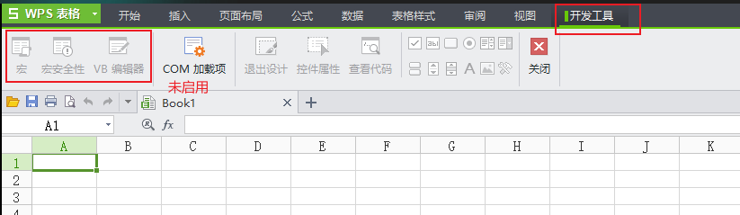

发现WPS没有启用VBA，

### 2、安装WPS的VBA插件包

[Visual_Basic_for_Application_7.0.1589](Visual_Basic_for_Application_7.0.1589.rar)

- 关闭excel
- 解压包：Visual_Basic_for_Application_7.0.1589.rar
- 安装包：Visual Basic for Application 7.0.1589.exe

### 3、打开excel检查VBA插件是否安装成功

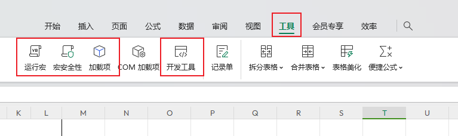

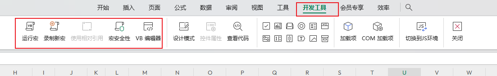

能看见这些东东，代表已经安装完成

### 4、使用VBA

1）进入VBA编辑器：开发工具->VB 编辑器

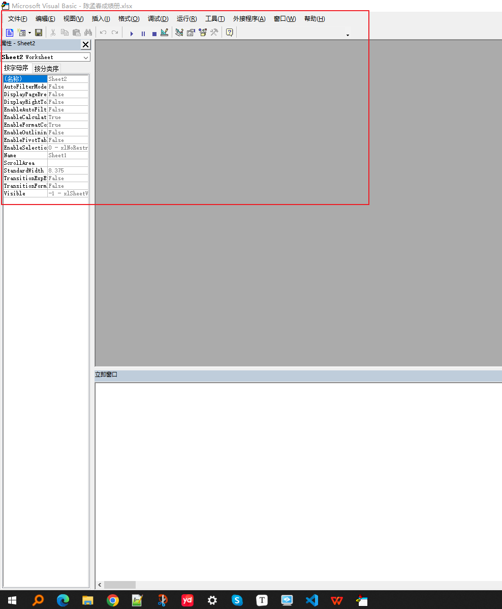

2）插入模板：插入->模块

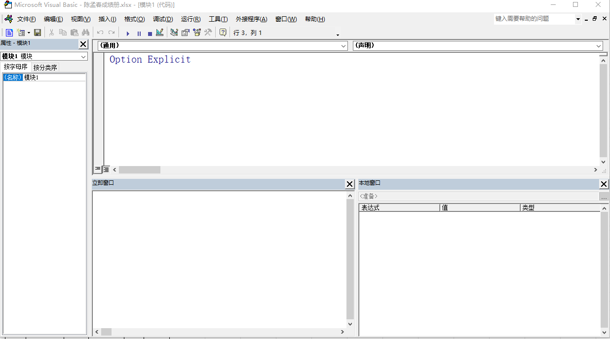

3）开始编码（在编辑区编码）

保存文件格式为“启用宏的工作簿（.xlsm）”

## TYComputer宏的使用

### 1）Sheet (standard) 的使用：这是后面的评分标准，放置在Sheet1并修改名称为“**standard**”

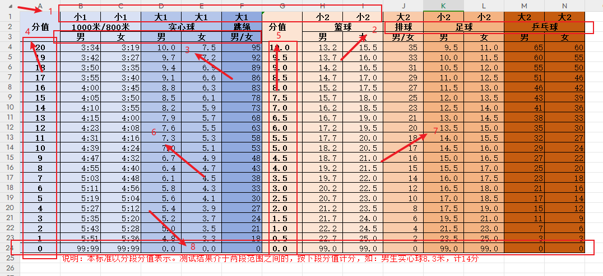

1：代表的是分值计算类型（小代表成绩越小分值4/5标越高，大代表成绩越大分值4/5标越高），计算成绩时需要这个作为判断

其中：“小1”或“大1”代表取的分值为4标分值（图中所标的4），“小2”或“大2”代表取的分值为5标分值（图中所标的5）

2：代表的是体育项目类型，该体育类型要与后面的成绩表中的体育项目类型一致，不然不能匹配到对应的体育项目类型

3：代表性别（男、女、男/女），该性别类型要与后面的成绩表中的性别类型一致，不然不能匹配到对应的性别类型

4/5：分别代表的不同类型的分值

6/7：成绩边界

8：代表0分边界，根据“大”或“小”分别添加最大值或最小值

**新增评分标准**

1、根据分值类型在6/7标分别增加列，明确1标“大1”或“小1”或“大2”或“小2”等标识

2、增加0分值的边界，根据“大”或“小”分别添加8标最大值或最小值

3、确保2标体育项目类型和3标性别类型要和后面的成绩表中类型一致

**表中数据格式化要求**

1、时间格式：以整数格式录入，并设置自定义格式：##:##。如下图，选择列->右键选择**设置单元格格式**->单元格格式对话框中选择**数字**->分类中选择**自定义**->类型中输入“**##:##**”，后面的成绩报表中的设置类似，后面不再描述。

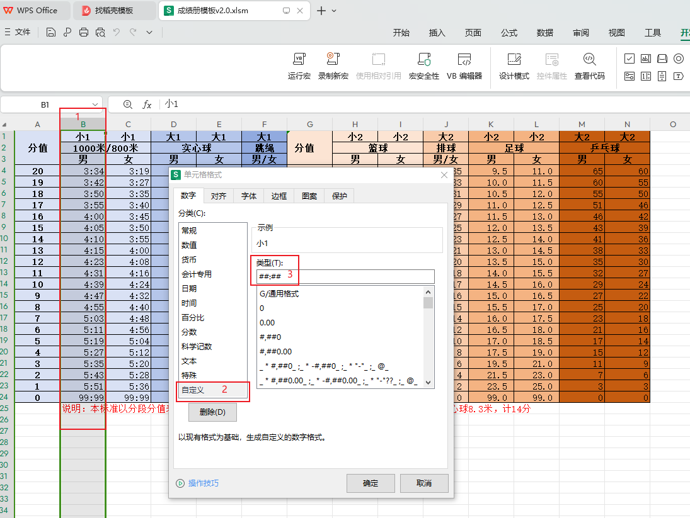

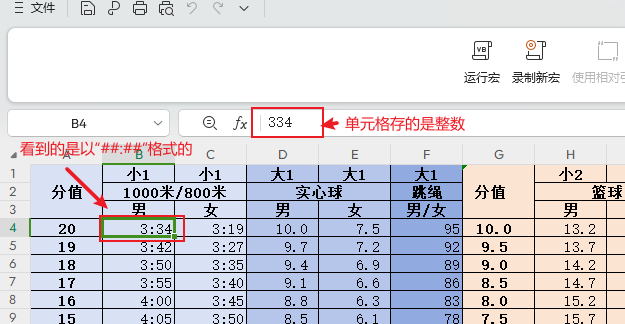

2、小数格式（保留一位小数）：输入小数保留以为小数。如下图，选择列->右键选择**设置单元格格式**->单元格格式对话框中选择**数字**->分类中选择**数值**->**小数位数**中设置1，后面的成绩报表中的设置类似，后面不再描述。

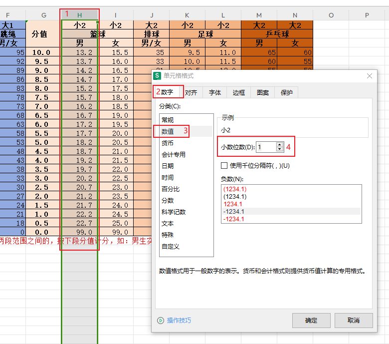

### 2）成绩表的使用：从Sheet2开始，可以自定义名称

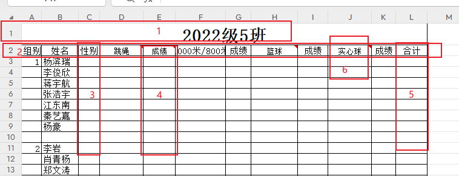

1：班级名称，一定要放在第一行

2：表头（组别/姓名/性别/项目/成绩/合计），一定放在第二行，姓名和性别列没有数据将不会进行宏计算

3：性别类型（只能是“男”或“女”，一定要与前面的“standard”表中的项目名称一致），一定放在第三列，姓名一定放在第二列

4：项目成绩，一定放在项目列的右边

5：成绩合计，一定要放在成绩表的最右列（表的最后一列）

6：项目名称，项目名称一定要与前面的“standard”表中的项目名称一致，增加项目时需在“合计”的左边增加两列，一列“项目”，一列“成绩”，“项目”列在“成绩”列的左侧。

第三行第四列开始项目列输入对应的分值，通过宏的计算会在“成绩”列中计算出成绩，会在“合计”列中算出总成绩

3）运行宏

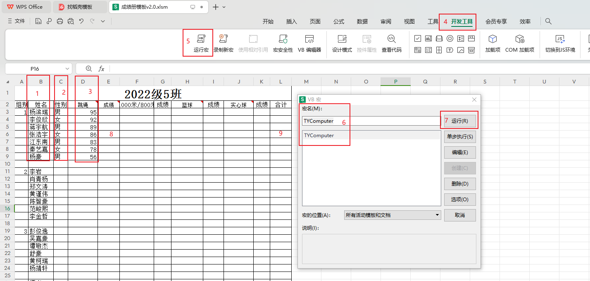

准备成绩表中的数据：1标姓名、2标性别和3标项目分值一定保证输入完整，缺少某一项将不会进入宏运算

准备好成绩表中数据后就可以开始运行宏命令

此时8标“成绩”列和9标“合计”列为空，选择4标开发工具->选择5标运行宏->在VB宏对话框中选择6标宏名“TYComputer”->点击7标运行

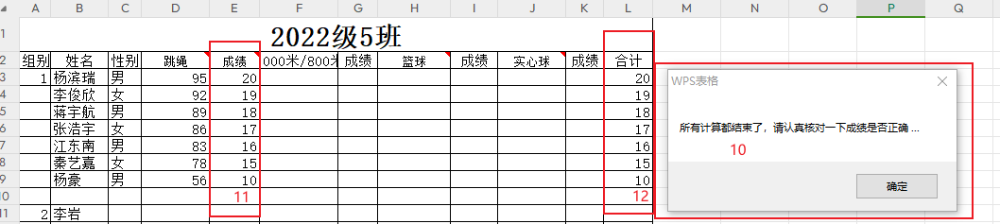

出现10标“所有计算都结束了，请认真核对一下成绩是否正确...”对话框，并且在11标“成绩”列和12标“合计”列中出现对应计算数值，代表运算成功

4）工作簿表格另存为

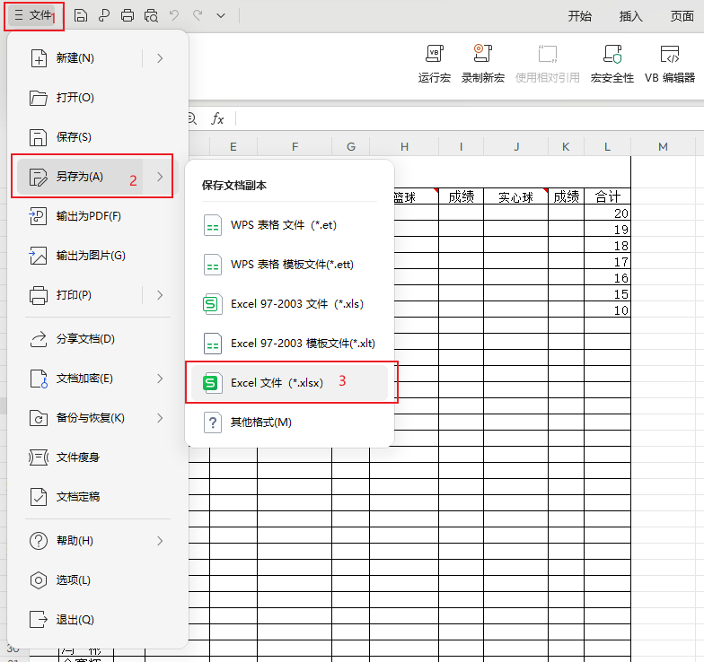

选择1标文件->选择2标另存为->选择3标Excel文件（*.xlsx）

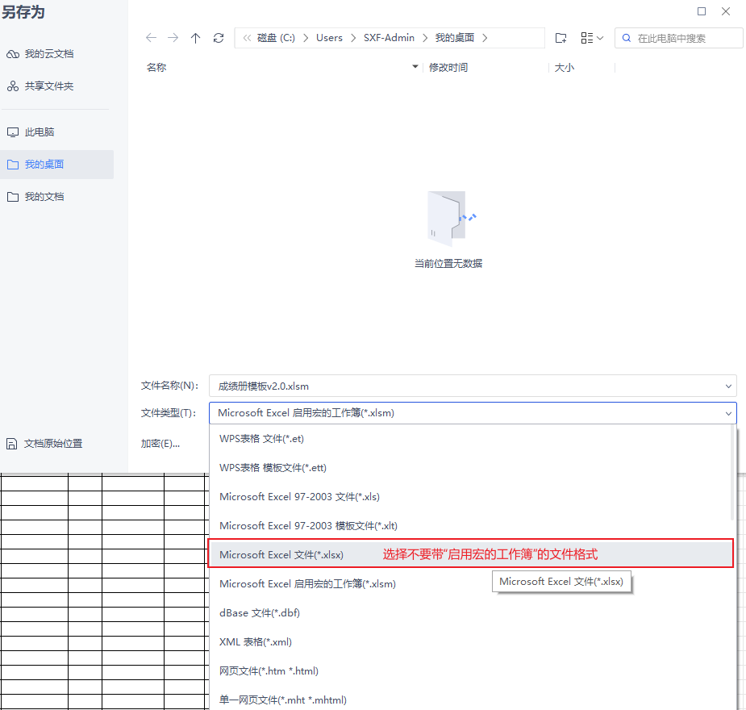

保存文件即可（选择不要带“启用宏的工作簿”的文件格式保存）

## 附件代码

```
'计算成绩表中的数据
Function Computer(sheetName As String)

    result = Sheets(sheetName).UsedRange

    standard = Sheets("standard").UsedRange

    '组别    姓名    性别    30秒跳绳    成绩    800、1000米 成绩    篮球运球    成绩    实心球  成绩    合计
    Debug.Print "=== 计算开始 === > 表名:" & sheetName
    
    Dim e As Integer
    
    For n = 4 To UBound(result, 2) '计算合计的位置列e
        
        If InStr(result(2, n), "合计") > 0 Then
            
            e = n
            
        End If
        
    Next n
    


    For i = 3 To UBound(result) '从第3行开始遍历
    
        'Debug.Print "i=" & i & " -> " & result(i, 2) & " - " & result(i, 3)
        
        If Len(result(i, 2)) > 0 And Len(result(i, 3)) > 0 Then '判断姓名result(i, 2)、性别result(i, 3)不为空
        
            Debug.Print
            
            Dim total As Single
                    
            total = 0
        
            For j = 5 To UBound(result, 2) Step 2 '获取“成绩”项result(i,j)
                
                If j < e And Len(result(i, j - 1)) > 0 Then '判断遍历j要小于合计e列，分数不能为空，分值result(i, j - 1)，体育项目名称result(2, j - 1)
                    
                    'Debug.Print "[" & i & "-" & j - 1 & "][" & result(2, j - 1) & "] 分值 -> " & result(i, j - 1)
                    
                    For a = 2 To UBound(standard, 2)
                    
                        If InStr(standard(2, a), result(2, j - 1)) > 0 Then '判断对应体育项目standard(2, a)，result(2, j - 1)
                        
                            If InStr(standard(3, a), result(i, 3)) > 0 Then '判断男女性别standard(3, a)，result(i, 3)
                            
                                C = a
                                
                            Else
                            
                                C = a + 1
                                
                            End If
                            
                            For b = 4 To UBound(standard) '查询数据类型standard(1, a) 和 性别standard(3, a)
                            
                                If InStr(standard(1, a), "大1") > 0 Then '判断分值计算类型是“大1”或者“小1”
                                    
                                    If Val(result(i, j - 1)) >= Val(standard(b, C)) Then
                                        
                                        result(i, j) = standard(b, 1)
                                        
                                        Exit For
                                    
                                    End If
                                    
                                    
                                ElseIf InStr(standard(1, a), "小1") > 0 Then '判断分值计算类型是“小1”
                                   
                                    If Val(result(i, j - 1)) <= Val(standard(b, C)) Then
                                    
                                        result(i, j) = standard(b, 1)

                                        Exit For
                                    
                                    End If
                                
                                
                                ElseIf InStr(standard(1, a), "大2") > 0 Then '判断分值计算类型是“大2”
                                
                                    If Val(result(i, j - 1)) >= Val(standard(b, C)) Then
                                    
                                        result(i, j) = standard(b, 7)
                                    
                                        Exit For
                                    
                                    End If
                                
                                ElseIf InStr(standard(1, a), "小2") > 0 Then '判断分值计算类型是“小2”
                                
                                    If Val(result(i, j - 1)) <= Val(standard(b, C)) Then
                                    
                                        result(i, j) = standard(b, 7)
                                    
                                        Exit For
                                    
                                    End If
                                    
                                Else '错误的分值计算类型
                                
                                    Debug.Print "xxx 错误的分值计算类型：" & standard(1, a)
                                    
                                    Exit For
                            
                                End If
                                
                            Next b
                        
                        End If
                        
                    Next a
                    
                    Debug.Print "[" & i & "-" & j - 1 & "][" & result(i, 2) & "][" & result(i, 3) & "][" & result(2, j - 1) & "] 分值 -> " & result(i, j - 1) & " 成绩 => " & result(i, j)

                    '计算合计，并赋值
                    total = total + result(i, j)
                    
                    If e > 0 Then
                    
                        result(i, e) = total
                    
                    End If
                
                End If
            
            Next j
            
            Debug.Print "[" & i & "-" & e & "]合计：" & result(i, e)
        
        End If
    
    Next i
    
    Sheets(sheetName).UsedRange = result
    
    Debug.Print "《 === 计算结束 === 表名:" & sheetName
    
End Function


'判断工作表是为空工作表（即所以单元格的值为空）自定义函数
Function isEmptySheet(ByVal sheet As Worksheet) As Boolean

    If Application.WorksheetFunction.CountA(sheet.Cells) > 0 Then
    
        isEmptySheet = False
        
    Else
    
        isEmptySheet = True
        
    End If
    
End Function


Sub TYComputer()

    Dim sht As Worksheet
    
    For i = 1 To Worksheets.count
    
        Set sht = Sheets(i)
        
        If isEmptySheet(sht) Then '判断是否为空表，为空表报错
                
            Debug.Print "【错误提示】 " & sht.name & " 是一个空表！"
            
        Else
            If InStr(sht.name, "standard") <= 0 Then
            
                Computer (sht.name)

            End If
        
        End If
         
    Next i
    
    MsgBox "所有计算都结束了，请认真核对一下成绩是否正确 ..."
    
End Sub

```

